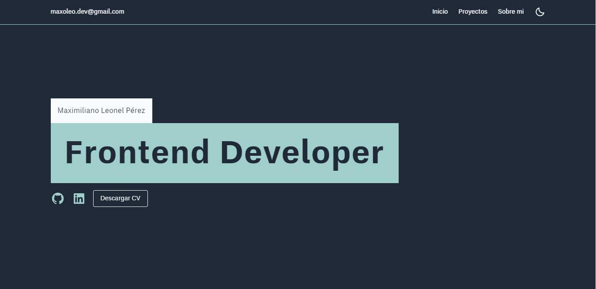

<h1 class="text-xl text-center text-slate-800">Mi portafolio</h1>

<h4 class="text-lg">\\ Descripción del proyecto</h4>

Este es mi portafolio personal donde presento un poco de mi trabajo, que si bien consiste en proyectos autodidactas, dan cuenta de mi recorrido en el desarrollo frontend. En este sitio podés encontrar mis proyectos, medios de contacto (teléfono, mail, redes sociales) y conocer sobre mi; qué tecnologías utilizo y estoy aprendiendo, mis objetivos e intereses.

El portafolio se encuentra en desarrollo permanente, puedo ir sumando nuevos proyectos y aportes según sea necesario

<h4 class="text-lg">\\ Funcionalidad</h4>

Medio de contacto: el portafolio tiene múltiples componentes que funcionan interactivamente con el usuario, para conectarlo a mis redes sociales, email, cv y proyectos de forma accesible y dinámica. 

<h4 class="text-lg">\\ Acceso al proyecto</h4>

<a href="https://maxoleo-dev.vercel.app" target="_blank">Acceda mediante este link</a> o en la descripción del proyecto.

<h4 class="text-lg">\\ Tecnologías utilizadas</h4>

<ul>
<li>Javascript</li>
<li>Typescript</li>
<li>React JS</li>
<li>Tailwind CSS </li>
<li>CSS</li>
<li>Git</li>
</ul>

<h4 class="text-lg">\\ Autor</h4>

Maximiliano Leonel Pérez

<a href="https://github.com/MaximilianoLeonel23" target="_blank">Github</a>
<a href="https://www.linkedin.com/in/maximiliano-leonel-p%C3%A9rez-8846b826a/" target="_blank">Linkedin</a>
